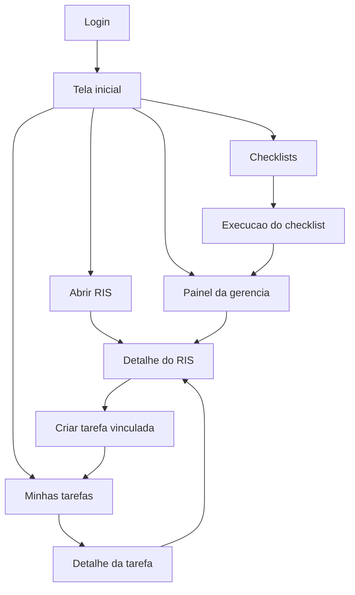

# Documento tecnico - RIS Control

## 1. Visao geral

O RIS Control e um app de gestao operacional para academias. O sistema centraliza registros de incidencia e solucao, tarefas, checklists, responsaveis, prazos, evidencias e historico de auditoria.

O objetivo e substituir comunicacoes soltas por registros formais, rastreaveis e acionaveis. Todo problema deve ter descricao, setor, local, gravidade, responsavel, prazo, status, historico e validacao quando necessario.

## 2. Objetivo do MVP

A primeira versao deve entregar o fluxo essencial de operacao:

- Login de usuarios.
- Cadastro de unidades, setores, cargos e funcionarios.
- Abertura de RIS com foto opcional.
- Classificacao, atribuicao de responsavel e prazo.
- Controle de status do RIS.
- Comentarios e historico imutavel.
- Criacao de tarefas simples.
- Criacao e execucao de checklist diario.
- Painel basico da gerencia.

Funcionalidades avancadas como WhatsApp, PDF, IA, ranking, manutencao preventiva e relatorios avancados ficam para versoes futuras.

## 3. Perfis de acesso

### Funcionario

Pode abrir RIS, ver os proprios RIS, executar tarefas atribuidas, enviar evidencias e comentar em tarefas proprias.

### Lider de setor

Pode ver RIS do setor, atribuir tarefas, validar checklists e acompanhar pendencias de funcionarios do setor.

### Gerente

Pode ver todos os dados operacionais, alterar status, definir responsaveis, validar solucoes, reabrir RIS, criar tarefas, criar checklists e acessar relatorios.

### Administrador/Dono

Pode ver tudo, criar unidades, setores, cargos, usuarios, configurar regras, exportar relatorios e auditar historico.

## 4. Modulos do sistema

### 4.1 RIS - Registro de Incidencia e Solucao

Funciona como boletim de ocorrencia interno da academia.

Fluxo principal:

1. Funcionario identifica um problema.
2. Abre um RIS pelo celular, tablet ou computador.
3. Informa titulo, descricao, setor, local, categoria, gravidade e evidencia.
4. Gerencia recebe e analisa.
5. Gerencia classifica, atribui responsavel e define prazo.
6. Responsavel executa a solucao.
7. Gerencia valida e encerra.
8. Se o problema voltar, o RIS pode ser reaberto.

Status do RIS:

- Reportado.
- Em analise.
- Aguardando responsavel.
- Em execucao.
- Solucionado.
- Cancelado com justificativa.
- Reaberto.

Categorias iniciais:

- Equipamentos.
- Limpeza.
- Estrutura fisica.
- Ar-condicionado.
- Iluminacao.
- Som.
- Catraca/acesso.
- Atendimento.
- Aluno.
- Seguranca.
- Financeiro.
- Sistema/software.
- Manutencao.
- Comportamento de funcionario.
- Comportamento de aluno.
- Outros.

Niveis de gravidade:

- Baixa: sem impacto imediato.
- Media: afeta a rotina, mas nao impede a operacao.
- Alta: afeta alunos, operacao ou seguranca.
- Critica: exige acao imediata.

### 4.2 Tarefas

Tarefas representam a execucao de uma pendencia. Podem ser criadas manualmente ou a partir de um RIS.

Status de tarefa:

- Pendente.
- Em andamento.
- Concluido.
- Atrasado.
- Reprovado pela gerencia.
- Refeito.
- Validado.

Cada tarefa pode exigir evidencia obrigatoria, como foto ou video, antes de permitir conclusao.

### 4.3 Checklists

Checklists organizam rotinas recorrentes por setor, cargo, funcionario ou periodo.

Tipos iniciais:

- Diario.
- Semanal.
- Mensal.
- Por setor.
- Por cargo.
- Por funcionario.
- Abertura.
- Fechamento.
- Limpeza.
- Manutencao.
- Comercial.
- Recepcao.
- Professores.

Exemplos de templates iniciais:

- Recepcao - Abertura.
- Professores - Turno.
- Limpeza - Diario.
- Gerencia - Diario.

### 4.4 Painel da gerencia

Indicadores do MVP:

- RIS abertos.
- RIS em analise.
- RIS solucionados.
- RIS atrasados.
- Tarefas pendentes.
- Tarefas atrasadas.
- Checklists concluidos no dia.
- Funcionarios com pendencias.
- Setores com mais problemas.
- Tempo medio de resolucao.

## 5. Telas principais

### 5.1 Login

Campos:

- Email ou usuario.
- Senha.

Regras:

- Usuario inativo nao pode acessar.
- Sessao deve identificar perfil de acesso.

### 5.2 Tela inicial

Conteudo:

- Meus RIS.
- Minhas tarefas.
- Checklists de hoje.
- Pendencias atrasadas.
- Botao principal: Abrir novo RIS.

### 5.3 Abrir RIS

Campos:

- Titulo do problema.
- Descricao.
- Local.
- Setor.
- Categoria.
- Gravidade.
- Urgencia.
- Foto ou video.

Acao:

- Enviar RIS.

Comportamento:

- Data, hora e usuario reportante sao preenchidos automaticamente.
- Novo RIS entra como Reportado.
- Gerencia deve ser notificada no painel.

### 5.4 Detalhe do RIS

Conteudo:

- Dados principais.
- Evidencias.
- Status atual.
- Responsavel.
- Prazo.
- Comentarios internos.
- Solucao aplicada.
- Validacao da gerencia.
- Historico de movimentacoes.

Acoes por permissao:

- Atribuir responsavel.
- Alterar status.
- Criar tarefa vinculada.
- Adicionar comentario.
- Marcar como solucionado.
- Validar solucao.
- Reabrir.
- Cancelar com justificativa.

### 5.5 Tarefas

Filtros:

- Hoje.
- Atrasadas.
- Concluidas.
- Setor.
- Funcionario.
- Status.

Campos:

- Titulo.
- Descricao.
- Responsavel.
- Setor.
- Prazo.
- Status.
- Evidencia obrigatoria.
- RIS vinculado, quando existir.

### 5.6 Checklists

Conteudo:

- Checklists disponiveis para o usuario.
- Progresso por checklist.
- Itens pendentes.
- Itens concluidos.
- Itens reprovados.

Cada item pode ter:

- Titulo.
- Descricao.
- Obrigatoriedade de evidencia.
- Status.
- Observacao.
- Foto ou video.

### 5.7 Gerencia

Conteudo:

- Cards de indicadores.
- Lista de RIS criticos.
- Lista de RIS atrasados.
- Tarefas atrasadas por responsavel.
- Checklists do dia.
- Ranking operacional por setor.
- Historico recente.

## 6. Modelo de dados sugerido

### users

- id.
- name.
- email.
- password_hash.
- role.
- unit_id.
- sector_id.
- position_id.
- active.
- created_at.
- updated_at.

### units

- id.
- name.
- address.
- active.
- created_at.
- updated_at.

### sectors

- id.
- unit_id.
- name.
- active.
- created_at.
- updated_at.

### positions

- id.
- name.
- description.
- active.
- created_at.
- updated_at.

### ris_records

- id.
- title.
- description.
- reporter_id.
- unit_id.
- sector_id.
- location.
- category.
- severity.
- urgency.
- assigned_to_id.
- due_at.
- status.
- solution_description.
- validated_by_id.
- validated_at.
- cancellation_reason.
- reopened_from_id.
- created_at.
- updated_at.

### ris_attachments

- id.
- ris_id.
- uploaded_by_id.
- file_url.
- file_type.
- created_at.

### ris_comments

- id.
- ris_id.
- user_id.
- comment.
- internal.
- created_at.

### tasks

- id.
- title.
- description.
- unit_id.
- sector_id.
- assigned_to_id.
- created_by_id.
- ris_id.
- due_at.
- status.
- requires_evidence.
- validation_required.
- validated_by_id.
- validated_at.
- rejection_reason.
- created_at.
- updated_at.

### task_attachments

- id.
- task_id.
- uploaded_by_id.
- file_url.
- file_type.
- created_at.

### checklist_templates

- id.
- name.
- type.
- unit_id.
- sector_id.
- position_id.
- active.
- created_by_id.
- created_at.
- updated_at.

### checklist_template_items

- id.
- template_id.
- title.
- description.
- sort_order.
- requires_evidence.
- created_at.
- updated_at.

### checklist_runs

- id.
- template_id.
- unit_id.
- assigned_to_id.
- sector_id.
- status.
- scheduled_for.
- started_at.
- completed_at.
- validated_by_id.
- validated_at.
- created_at.
- updated_at.

### checklist_run_items

- id.
- checklist_run_id.
- template_item_id.
- status.
- observation.
- evidence_url.
- completed_by_id.
- completed_at.
- validated_by_id.
- validated_at.
- rejection_reason.

### audit_logs

- id.
- entity_type.
- entity_id.
- action.
- old_value.
- new_value.
- changed_by_id.
- created_at.

## 7. Regras de negocio

- Todo RIS deve manter historico imutavel de criacao, alteracao de status, atribuicao, comentario relevante, cancelamento, solucao, validacao e reabertura.
- RIS cancelado exige justificativa.
- RIS solucionado pode exigir validacao da gerencia antes de ser considerado encerrado.
- RIS reaberto deve preservar o historico anterior.
- Tarefa com evidencia obrigatoria nao pode ser concluida sem anexo.
- Tarefa reprovada pela gerencia deve voltar como Reprovado pela gerencia e permitir correcao como Refeito.
- Checklist concluido pode exigir validacao, dependendo do template.
- Usuario funcionario nao pode alterar responsavel, prazo ou validacao de RIS.
- Lider de setor nao pode ver dados de outros setores, exceto quando autorizado.
- Gerente e administrador podem ver todos os dados da unidade.
- Administrador pode ver dados de todas as unidades.
- Nenhum registro operacional deve ser apagado fisicamente no MVP; usar inativacao ou cancelamento auditado.

## 8. Automacoes recomendadas

- Ao criar RIS critico, destacar no painel da gerencia.
- Ao atribuir responsavel e prazo a um RIS, criar tarefa vinculada opcionalmente.
- Ao concluir tarefa vinculada a RIS, sugerir alteracao do RIS para Solucionado.
- Ao reprovar tarefa, registrar motivo e exigir nova evidencia.
- Ao vencer prazo, marcar RIS ou tarefa como atrasado automaticamente.
- Ao iniciar o dia, gerar checklists diarios a partir dos templates ativos.

## 9. Permissoes resumidas

| Acao | Funcionario | Lider | Gerente | Admin |
| --- | --- | --- | --- | --- |
| Abrir RIS | Sim | Sim | Sim | Sim |
| Ver proprio RIS | Sim | Sim | Sim | Sim |
| Ver RIS do setor | Nao | Sim | Sim | Sim |
| Ver todos os RIS | Nao | Nao | Sim | Sim |
| Atribuir responsavel | Nao | Setor | Sim | Sim |
| Alterar status | Parcial | Setor | Sim | Sim |
| Validar solucao | Nao | Setor | Sim | Sim |
| Criar checklist | Nao | Setor | Sim | Sim |
| Criar usuario | Nao | Nao | Nao | Sim |
| Exportar relatorio | Nao | Nao | Sim | Sim |

## 10. Backlog do MVP

### Prioridade 1

- Autenticacao.
- CRUD de usuarios.
- CRUD de setores.
- Abertura de RIS.
- Listagem de RIS.
- Detalhe de RIS.
- Alteracao de status.
- Atribuicao de responsavel.
- Prazo do RIS.
- Comentarios.
- Historico auditavel.

### Prioridade 2

- Upload de fotos.
- Criacao de tarefas.
- Vinculo entre RIS e tarefa.
- Tela de minhas tarefas.
- Status de tarefa.
- Evidencia obrigatoria em tarefa.

### Prioridade 3

- Templates de checklist.
- Execucao de checklist diario.
- Validacao de checklist.
- Painel basico da gerencia.
- Indicadores de atraso.

## 11. Criterios de aceite do MVP

- Um funcionario consegue abrir um RIS pelo celular com titulo, descricao, setor, local, gravidade e foto.
- A gerencia consegue visualizar o RIS no painel.
- A gerencia consegue atribuir responsavel e prazo.
- O responsavel consegue ver a tarefa ou RIS atribuido.
- O responsavel consegue comentar e marcar como concluido.
- A gerencia consegue validar ou reabrir.
- Toda mudanca importante aparece no historico com usuario, data e hora.
- Um checklist diario pode ser criado, executado e validado.
- O painel mostra contadores de RIS abertos, atrasados, solucionados e tarefas pendentes.

## 12. Sugestao de stack para implementacao

Para uma versao web simples e evolutiva:

- Frontend: React ou Next.js.
- Backend: Next.js API routes, NestJS ou Express.
- Banco de dados: PostgreSQL.
- ORM: Prisma.
- Autenticacao: Auth.js, JWT ou sessao propria.
- Armazenamento de arquivos: S3 compativel, Supabase Storage ou armazenamento local no prototipo.
- Deploy inicial: Vercel, Render, Railway ou VPS.

Para prototipo local rapido:

- HTML, CSS e JavaScript.
- Persistencia em localStorage.
- Upload simulado com preview local.

## 13. Fluxo de navegacao

## 14. Prompt base para o Codex implementar

Implemente o MVP do RIS Control como um app web de gestao operacional para academia. O sistema deve ter login, perfis de acesso, cadastro de usuarios, setores e cargos, abertura de RIS, listagem, detalhe, status, responsavel, prazo, comentarios, historico auditavel, tarefas vinculadas e checklists diarios. Priorize uma interface responsiva para celular e desktop, com foco em uso operacional rapido por funcionarios e painel claro para gerencia. Use o documento tecnico `DOCUMENTO_TECNICO_RIS_CONTROL.md` como fonte de verdade para regras, telas, entidades e criterios de aceite.
